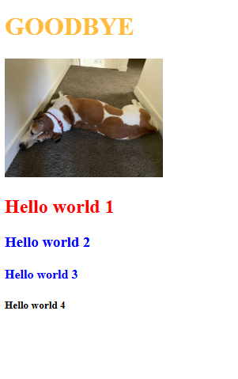

# ad-l1
AD-02-1 InteractingWithHTML-CSS-JS-Individual
# 🌐 Web Fundamentals – Lesson Project

Este proyecto implementa una página web sencilla utilizando **HTML**, **CSS** y **JavaScript**, siguiendo un plan de actividades para practicar estructura, estilos y manipulación del DOM.

## 📁 Contenido del Proyecto

El proyecto está compuesto por tres archivos principales:

- `index.html`
- `style.css`
- `script.js`
- Carpeta `/Pictures` con la imagen utilizada.

---

## ✅ Funcionalidades Implementadas

### 🔹 HTML

En el archivo `index.html` se realizó:

- Agregar un header con el texto **"Hello world!"**.
- Insertar una imagen desde la carpeta **Pictures**.
- Añadir un elemento con `id="red"`.
- Crear cuatro encabezados adicionales con el texto **"Hello world"**.
- Aplicar dos atributos `class="blue"` en distintos elementos.
- Vincular correctamente `style.css` y `script.js`.

---

### 🔹 CSS

En `style.css` se implementó:

- Estilizar todos los elementos `<h1>` con color **green**.
- Crear la clase `.blue` para aplicar color **blue**.
- Crear el id `#red` para aplicar color **red**.
- Agregar una pequeña animación **fade-in** para resaltar un header al hacer clic.

---

### 🔹 JavaScript

En `script.js` se desarrolló:

- Modificar el primer **"Hello World!"** y reemplazarlo por **"GoodBye"** dinámicamente.
- Cambiar el color de un header a **orange** mediante JavaScript.
- Hacer un header clickeable para que cambie su color a **brown** al hacer clic.
- Agregar una animación **fade-in suave** aplicada mediante clases CSS.

---

## 💡 Conceptos Prácticos Aplicados

- Uso de IDs y clases.
- Manipulación del DOM con `getElementById` y `querySelector`.
- Eventos como `click`.
- Estilos mediante CSS externo.
- Animaciones CSS ligeras.
- Separación correcta de HTML, CSS y JS.

---

## 📚 Resultado

El proyecto final muestra y combina:

- Estructura HTML básica
- Estilos personalizables con CSS
- Interacción real mediante JavaScript

⭐Como valor agregado se añadió una animación en JavaScript que hace que la palabra "goodbye" desaparezca

